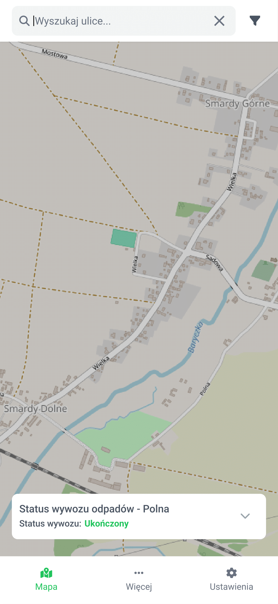
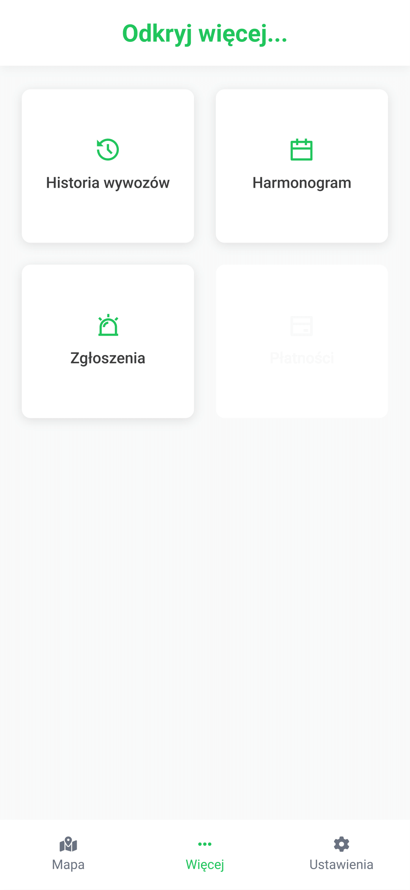
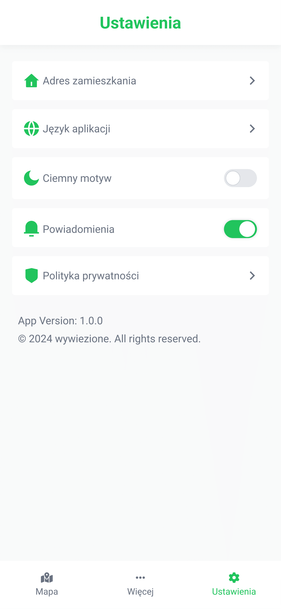
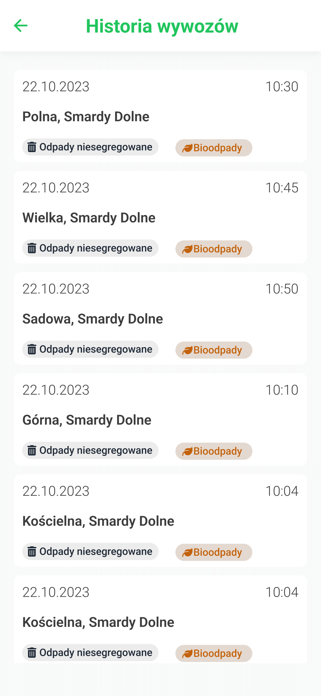
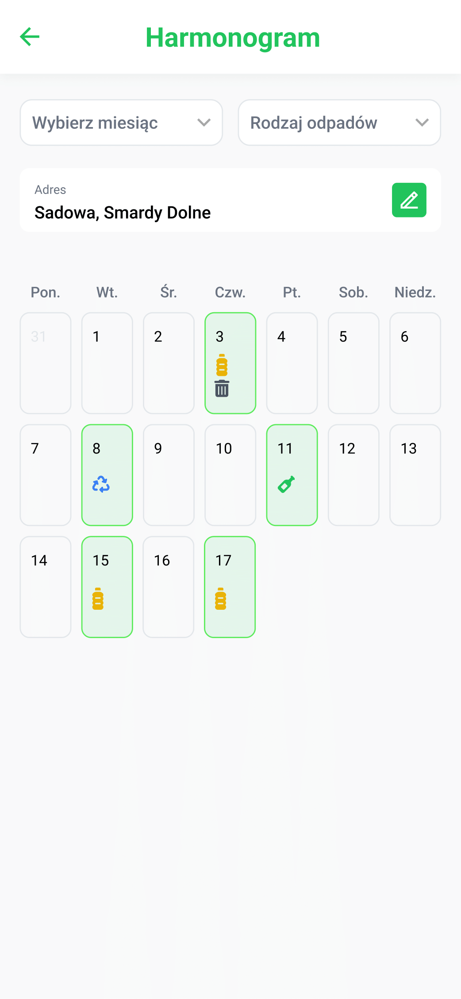
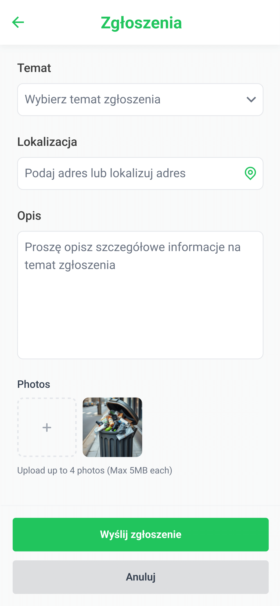
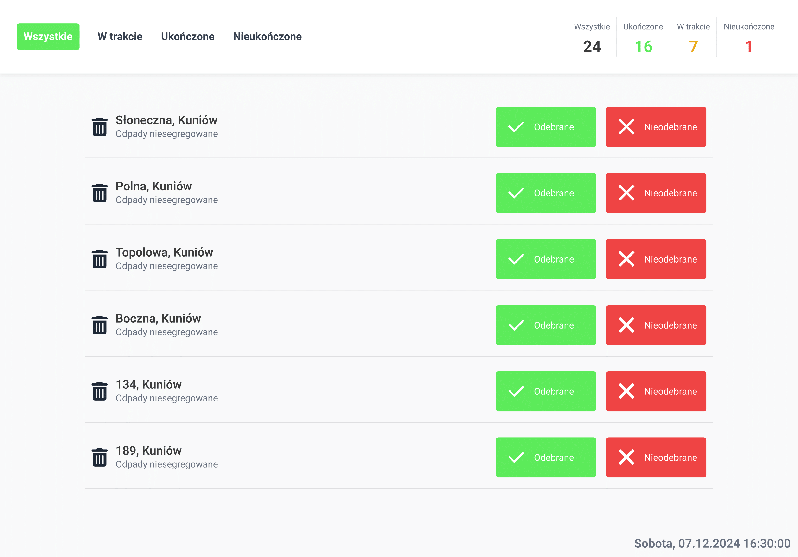

# Wywiezione? 🚛

**Wywiezione?** - to aplikacja mobilna i webowa, która umożliwia mieszkańcom śledzenie statusu wywozu odpadów w czasie rzeczywistym, zgłaszanie problemów i zarządzanie harmonogramami. Pracownicy mają dostęp do panelu zadaniowego, a administratorzy mogą efektywnie zarządzać zespołami i harmonogramami.

---

## 🖼️ Wizualizacje ekranów

### **1. Ekran główny aplikacji dla mieszkańców**

### **2. Menu zawierajace kafelki z dodatkowymi opcjami aplikacji**

### **3. **Ekran ustawień aplikacji**

### **4. Ekran historii wywozów**

### **5. Ekran harmonogramu wywozów**

### **5. Ekran zgłoszeń**

### **6. Ekran głównego okna dla pracowników**

