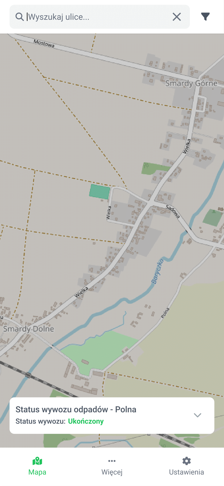
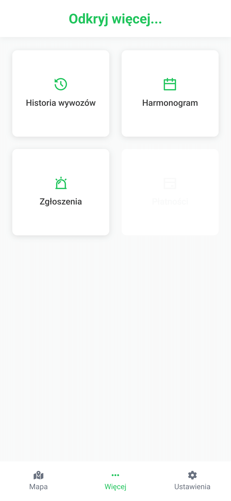
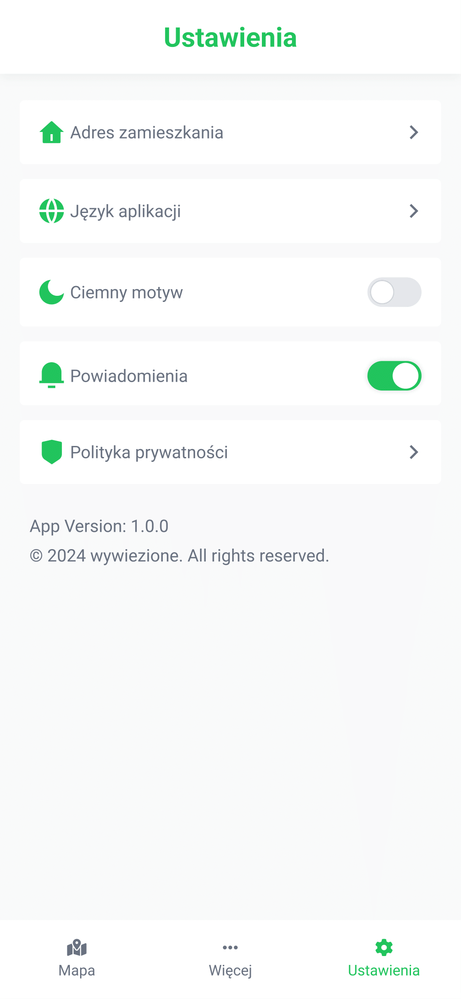
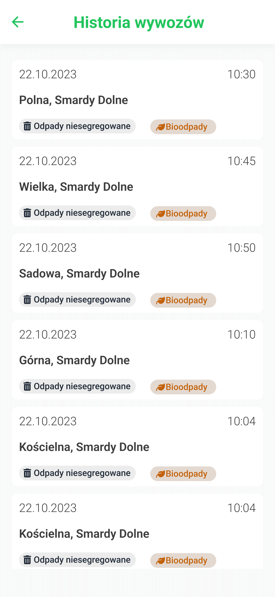
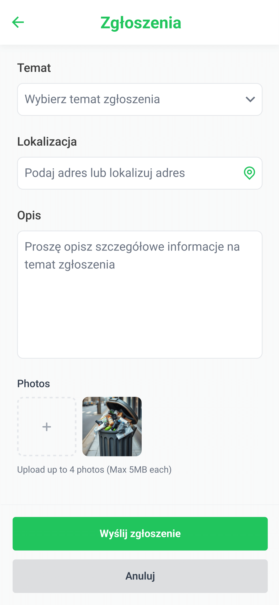
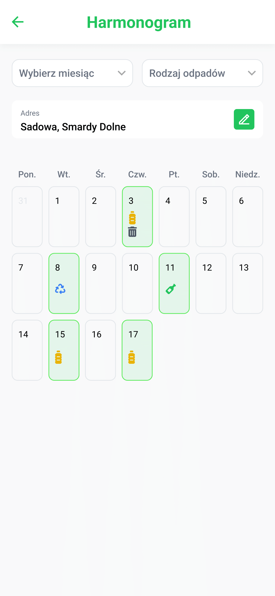
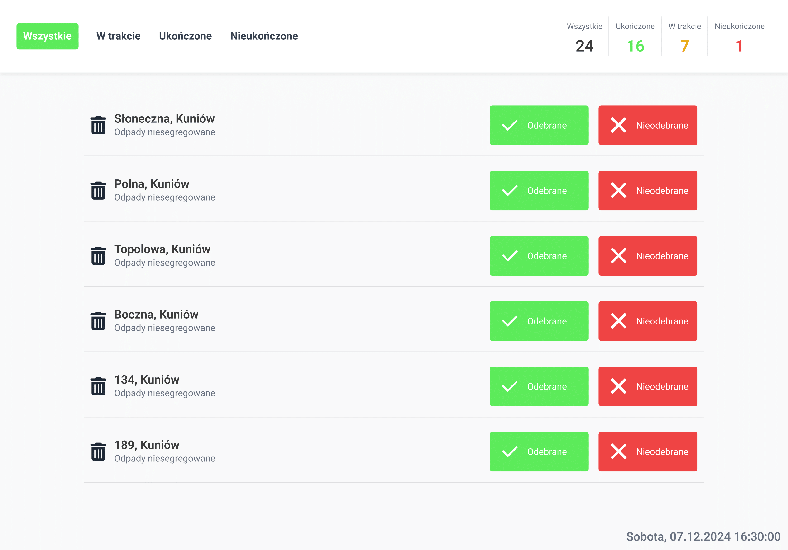

# Wizualizacje ekranów

|  Ekran główny aplikacji dla mieszkańców  | Menu zawierajace kafelki z dodatkowymi opcjami aplikacji |
| :--------------------------------------: | :------------------------------------------------------: |
|  |                          |

|          Ekran ustawień aplikacji          |           Ekran historii wywozów           |
| :----------------------------------------: | :----------------------------------------: |
|  |  |

|               Ekran zgłoszeń               |              Ekran harmonogramu              |
| :----------------------------------------: | :------------------------------------------: |
|  |  |

#### Ekran głównego okna dla pracowników

